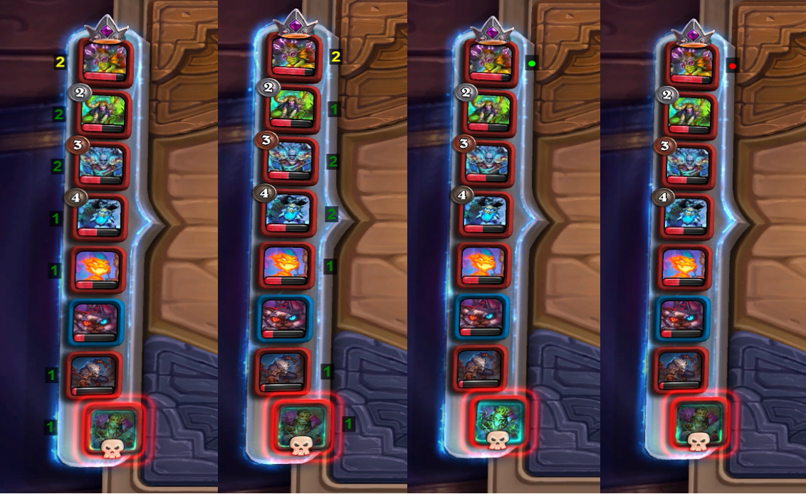
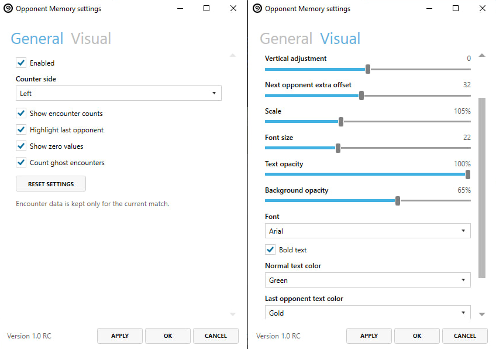

# Opponent Memory

Opponent Memory is a plugin for [Hearthstone Deck Tracker](https://github.com/HearthSim/Hearthstone-Deck-Tracker) that tracks how many completed combats you have played against each opponent in the current Solo Battlegrounds match.

The counters can help you estimate who you might face next or quickly find your previous opponent when checking their last known warband.

The plugin is intended for the Windows version of HDT.

## Screenshots

### In game

### Settings

## Features

* Counts completed combats against each opponent
* Highlights the opponent from your most recently completed combat
* Can show a compact marker instead of encounter counts
* Places counters on either side of the leaderboard portraits
* Supports custom positioning and per-row horizontal adjustments
* Includes scale, font, text style, color and opacity settings
* Keeps encounter data in memory only for the current match
* Works locally without telemetry, analytics or gameplay data uploads

## How to use

The number beside each opponent shows how many completed combat rounds you have played against that player during the current match. The counter changes only after combat has ended.

Opponent Memory identifies opponents by temporary in-game player IDs, not by player names. It clears all encounter data when the match ends, a new match begins or the plugin is unloaded.

You can display the most recent opponent in a different color. When encounter counts are hidden, the plugin can show a colored dot instead.

## Limitations

Opponent Memory supports **Solo Battlegrounds only**.

Battlegrounds Duos is not supported. The overlay stays hidden in unsupported modes, and the plugin does not count encounters.

## Configuration

Open:

`Options -> Tracker -> Plugins -> Opponent Memory -> Settings`

Available settings include:

* Counter side
* Show or hide encounter counts
* Highlight the last opponent
* Show zero values
* Count ghost encounters
* Horizontal and vertical positioning
* Per-row horizontal adjustment
* Next-opponent extra offset
* Scale and font
* Text and background colors
* Text and background opacity

## Installation

Download the latest release from:

https://github.com/numbereleven-a/HDT-OpponentMemory/releases/latest

Then install it using one of the standard HDT plugin methods.

### Drag and drop

1. Open `Options -> Tracker -> Plugins`
2. Drag the downloaded `.zip` or `.dll` into the plugins window
3. Restart HDT
4. Enable `Opponent Memory`

### Manual install

1. Extract the release archive into `%appdata%\HearthstoneDeckTracker\Plugins`
2. Restart HDT
3. Enable `Opponent Memory` in `Options -> Tracker -> Plugins`

If the plugin does not appear, right-click `OpponentMemory.dll`, open `Properties`, and click `Unblock`.

## Download

